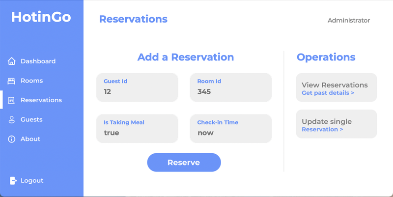
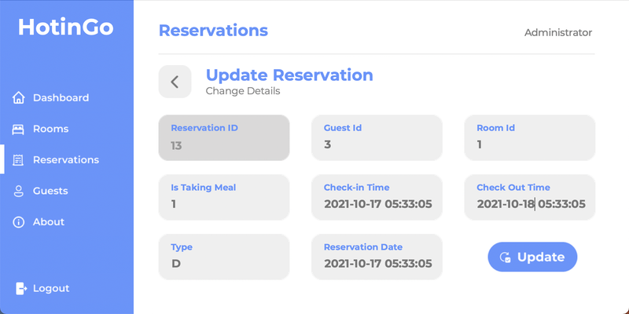
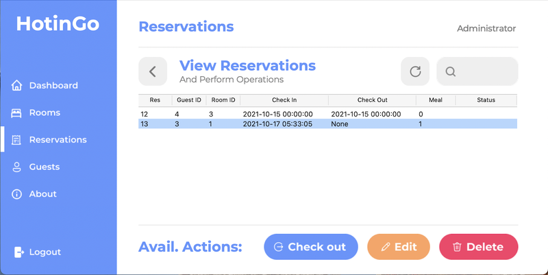
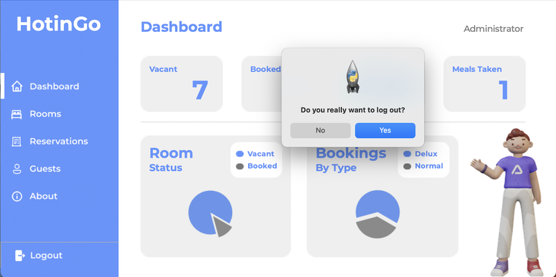

<!-- TABLE OF CONTENTS -->
<details>
  <summary>Table of Contents</summary>
  <ol>
    <li>
      <a href="#about-the-project">About The Project</a>
      <ul>
        <li><a href="#screenshots">Screenshots</a></li>
        <li><a href="#motivation">Motivation</a></li>
        <li><a href="#built-with">Built With</a></li>
      </ul>
    </li>
    <li>
      <a href="#getting-started">Getting Started</a>
      <ul>
        <li><a href="#prerequisites">Prerequisites</a></li>
        <li><a href="#installation">Installation</a></li>
        <li><a href="#extras">Extras</a></li>
        <ul>
            <li><a href="#adding-new-users">Adding New Users</a></li>
        </ul>
      </ul>
    </li>
    <li><a href="#usage">Usage</a></li>
    <li><a href="#roadmap">Roadmap</a></li>
    <li><a href="#contributing">Contributing</a></li>
    <li><a href="#license">License</a></li>
    <li><a href="#contact">Contact</a></li>
    <li><a href="#acknowledgments">Acknowledgments</a></li>
  </ol>
</details>

<!-- ABOUT THE PROJECT -->

# About The Project

<a href="https://projects.mohityadav.codes/#HotinGo">
    
</a>

HotinGo is an open source, design-focued and the coolest Python-based Hotel Management System on GitHub. Built with Python 3, Tkinter and MySQL, and initially created as a high school CS project, it comprises of all the necessary Hotel Management **features** like:

-   Login 🔑 and Authentication through 🐬 MySQL database 😍
-   The ability to add, update, view and delete new records for:
    -   🔐 Rooms,
    -   💁 Guests, and
    -   ⏰ Reservations
- Secret Storage 👮 and handling using 💻 environment variables

This project was created as a proof that ancient frameworks like Tkinter could be used to create impressive applications with beautiful user interfaces.

<p align="right">(<a href="#top">back to top</a>)</p>

## Screenshots

Here is a sneak peak of the application and it's visuals 😍:

<table>
    <tr>
        <td>
            
            <br />
            <p align="center">Add Reservation Page</p></td>
        <td>
            
            <br />
            <p align="center">Update Reservation</p></td>
    </tr>
    <tr>
        <td>
            
            <br />
            <p align="center">View Reservations</p></td>
        <td>
            
            <br />
            <p align="center">Confirm Logout</p></td>
    </tr>
</table>

Want to create your own iteration? [View the designs on Figma](https://www.figma.com/file/MVq5Q3fhVJB2r70r7I3nJ3/HotinGo?node-id=102%3A2), and then export to Python code with [Tkinter Designer](https://github.com/ParthJadhav/Tkinter-Designer) ☄️.

<p align="right">(<a href="#top">back to top</a>)</p>

<!-- Motivation -->


## Built With (Tech Stack)

The following technologies were involved in the making of this project.

-   [Python 3](https://python.org/) 🐍 - For running the main application code
-   [Tkinter](https://docs.python.org/3/library/tk.html/) & [TTk](https://docs.python.org/3/library/tkinter.ttk.html) - For the user Interface
-   [MySQL Server](https://www.mysql.com/) 🐬 - For handling database and queries
-   [MySQL Connector Python](https://dev.mysql.com/doc/connector-python/en/) - For querying MySQL through python
-   [Tkinter Designer](https://github.com/ParthJadhav/Tkinter-Designer) ☄️ - For exporting the Figma user interface to python code
-   [Numpy](https://numpy.org/) 🧮 - As a dependency for Matplotlib
-   [Matplotlib](https://matplotlib.org/) 📈 - For creating and showing graphs and visualizations
-   [Python Dotenv](https://github.com/theskumar/python-dotenv) 🤫 - For loading environment variables from the [`.env` file](https://zetcode.com/javascript/dotenv/)

<p align="right">(<a href="#top">back to top</a>)</p>

<!-- GETTING STARTED -->

# Getting Started

This is an example of how you may give instructions on setting up your project locally.
To get a local copy up and running follow these simple example steps.

## Prerequisites

This is an example of how to list things you need to use the software and how to install them.

-   Python 3 - [Download instructions here](https://www.python.org/downloads/)
-   Pip 3 (usually gets installed automatically with Python)
-   MySQL Server - If you haven't already, [download the package from here](https://dev.mysql.com/downloads/installer/), then create a user account and note the username and password

If all the above are satisfied, you may proceed to the next section.

## Installation 

Follow these insturctions to setup your own instance of the app:

(**<u>PS</u>**: The instructions may look lenghty, but they;re simple and just explained in detail, so please don't click away. I would highly recommend you having a look at the codebase and trying the app for yourself.)

### 1: Clone the repo

Find instructions for [cloning/downloading this repo here](https://docs.github.com/en/repositories/creating-and-managing-repositories/cloning-a-repository), then unzip the repository

Or if you have git command line installed, clone using this command:

### 2: Cd to the folder

Open terminal/cmd/powershell and change directory/folder to the cloned folder. [Here are the instructions](https://www.howtogeek.com/659411/how-to-change-directories-in-command-prompt-on-windows-10/)

The command for the same would be

```sh
cd Location\ To/Hotingo
```

### 3: Install the PIP packages/dependencies

After you cd into the repo folder, ensure you see the following cmd/terminal prompt

```sh
Something.../HotinGo $
```

If not, repeat the previous step.

After this, run the following command in cmd/terminal:

```sh
pip install -r requirements.txt
```

### 4: Setup the database

To create the database from the MySQL schema, either:

1: Copy-paste the contents of [sql/hms.sql](sql/hms.sql) directly into the MySQL command line, or

2: Use the command to do it automatically (from cmd)

```sh
mysql -u <mysql-username> -p<mysql-password> < hms.sql
```

This will create and setup the database.

(**<u>Note</u>**: Don't **include the "<>" angular brackets** in the command, and replace the `<mysql-username>` and `<mysql-password>` with the credentials created, as discussed in the [Prerequisites Section](#Prerequisites))

### 5: Add database credentials to the app

Start by renaming the `.example.env` file just `.env`, and then replacing the `Your-Username` and `Your-Password` values with the MySQL credentials.

### 6: Installing Fonts

In order to make the app's gui look good, you will have to install the Montserrat font. From the `assets` folder, install all three fonts (with `.ttf` format) by double clicking them.

### 7: It's done 🎉 | Run the app

Run `main.py` file with python 3 and you should see the login window, if you have followed each step correctly.

The default username and password are `username` and `password` respectively.

<p align="right">(<a href="#top">back to top</a>)</p>

## Extras

Here are some things you may try with the app

### Adding new users

To add new login credentials, you will have to create new users by directly adding records to the database in the `login` table. Run the command to insert new login credentials:

```sql
INSERT INTO login (username, password) values ("your-username", "your-password");
```

(**<u>PS</u>**: This is the only part of the app that requires direct database interactions, since you can't add a signup page to an admin-based application without compromising on security, though our previous app versions had the feature, along with reset and forget password.)

<p align="right">(<a href="#top">back to top</a>)</p>

<!-- ROADMAP -->


